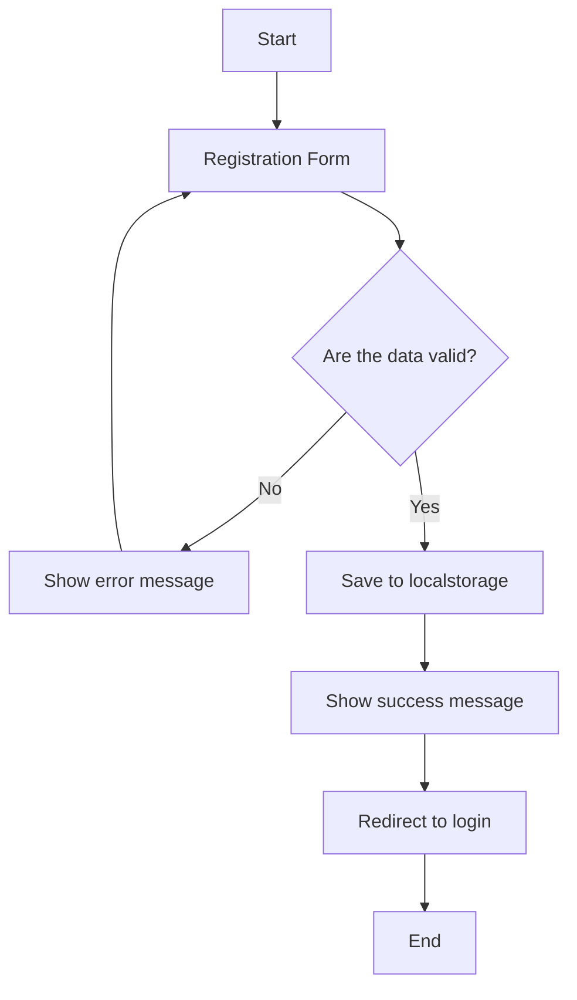

```mermaid
graph TD;
  A[Start] --> B[Registration Form]
  B --> C{Are the data valid?}
  C -- No --> D[Show error message]
  D --> B
  C -- Yes --> E[Save to localstorage]
  E --> F[Show success message]
  F --> G[Redirect to login]
  G --> H[End]
```